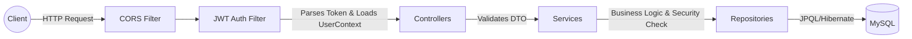

# Vault: Finance Dashboard API

 
 
 
 


Vault is a production-grade backend REST API for a financial dashboard application. It provides robust transaction management, multi-tier Role-Based Access Control (RBAC), and high-performance financial analytics and aggregations. 

The project was built with a strong focus on **clean architecture, security, and query optimization**.

---

## 🔥 Key Features

* **Advanced Role-Based Access Control (RBAC):** Three strictly enforced permission tiers (`VIEWER`, `ANALYST`, `ADMIN`) using Spring Security `@PreAuthorize` and method-level security.
* **Stateless Authentication:** Custom JWT-based authentication flow with BCrypt password hashing.
* **Optimized Aggregations:** Complex dashboard metrics computed efficiently using type-safe JPQL constructor expressions, minimizing database roundtrips.
* **Resilient Data Integrity:** Immutable financial records with soft-delete patterns for audit compliance.
* **Performance Tuned:** Specifically handled `N+1` query issues using `JOIN FETCH` and optimized read-heavy operations with `@Transactional(readOnly=true)`.
* **Bulletproof Validation:** Comprehensive input sanitation using Jakarta Bean Validation with strict limit/boundary enforcement to prevent unbounded queries.

---

## 🛠️ Tech Stack

* **Core:** Java 17, Spring Boot 3.2.4
* **Security:** Spring Security 6, JWT (io.jsonwebtoken)
* **Database & ORM:** MySQL 8, Spring Data JPA, Hibernate
* **Tooling:** Lombok, Maven, Swagger/OpenAPI 3
* **Testing:** JUnit 5, Mockito

---

## 🏗️ Architecture

The application follows a strict **Layered Architecture** with strict boundary isolation via DTOs. Entities are never exposed to the presentation layer.



### Role & Permission Matrix

| Endpoint Group | VIEWER | ANALYST | ADMIN |
|---|:---:|:---:|:---:|
| **GET** `/transactions/**` | ✅ | ✅ | ✅ |
| **POST/PUT/DEL** `/transactions/**` | ❌ | ❌ | ✅ |
| **GET** `/dashboard/summary` | ✅ | ✅ | ✅ |
| **GET** `/dashboard/trends` | ❌ | ✅ | ✅ |
| **ALL** `/users/**` (Manage Users) | ❌ | ❌ | ✅ |

*(Admins are prevented from self-demotion or self-deactivation via service-level invariant checks).*

---

## 📊 Database Schema Summary

The core application revolves around `users` and `transactions`. It leverages JPA Auditing (`@CreatedDate`, `@LastModifiedDate`) to automatically stamp entities.

*   `users`: Stores credentials, role enumerations, and account statuses.
*   `transactions`: Core financial records. Strictly utilizes exact numeric types (`DECIMAL(15,2)` mapped to `BigDecimal` in Java) to prevent IEEE 754 floating-point inaccuracies. Optimized with indexes on `type`, `date`, `category`, and `deleted` flags.

---

## 🔌 Core API Endpoints

### Authentication
* `POST /api/auth/register` - Create new account (Defaults to VIEWER)
* `POST /api/auth/login` - Authenticate and receive `Bearer` token
* `GET /api/auth/me` - Get current authenticated profile

### Transactions
* `POST /api/transactions` - Create transaction (Admin only)
* `GET /api/transactions` - Paginated & filtered list (All roles) 
* `PUT /api/transactions/{id}` - Update transaction (Admin only)
* `DELETE /api/transactions/{id}` - Soft-delete transaction (Admin only)

### Dashboard Analytics
* `GET /api/dashboard/summary` - Core financial KPIs
* `GET /api/dashboard/category-wise` - Expenses aggregated by category
* `GET /api/dashboard/trends` - Monthly timeline aggregations
* `GET /api/dashboard/recent` - Latest ledger entries (N+1 optimized)

---

## 🚀 Setup & Installation

### Prerequisites
* Java 17+
* MySQL 8
* Maven

### Local Setup
1. **Clone the repository:**
   ```bash
   git clone https://github.com/yourusername/vault-finance-api.git
   cd vault-finance-api
   ```
2. **Configure Environment Variables (IMPORTANT):**
   This project uses environment variables to keep sensitive credentials secure and out of the source code.
   
   * You need to create a file exactly named `.env` in the root folder of the project.
   * Make sure this `.env` file is never committed (it is already added to `.gitignore`).
   
   Copy the following text and put it into your `.env` file:
   ```env
   DB_URL=jdbc:mysql://localhost:3306/finance_db?createDatabaseIfNotExist=true
   DB_USERNAME=root
   DB_PASSWORD=your_secure_password
   JWT_SECRET=your_super_secure_256_bit_hash_key_here
   CORS_ORIGINS=http://localhost:3000,http://localhost:5173
   ```
   *Note: Spring Boot will automatically load these variables because we have `spring.config.import=optional:file:.env[.properties]` defined in the `application.properties`.*

3. **Build and Run:**
   ```bash
   mvn clean install
   mvn spring-boot:run
   ```
4. **Access Swagger UI:** Navigate to `http://localhost:8080/swagger-ui.html`

---

## 📈 Engineering Improvements & Lessons Learned

A key focus of this project was moving beyond simple CRUD functionality to resolve real-world performance and integrity challenges:

1. **Eliminating the N+1 Query Problem:** 
   * *Issue:* Fetching recent transactions caused an N+1 cascade when lazy-loading the `createdBy` user entity.
   * *Fix:* Implemented `JOIN FETCH` inside the JPQL repository query, reducing queries from 11 down to 1.
2. **Type-Safe Aggregations:** 
   * *Issue:* Native `Object[]` arrays for group-by analytics queries were fragile and prone to runtime casting errors.
   * *Fix:* Transitioned to fully type-safe **JPQL Constructor Expressions** (e.g., `SELECT new dto(t.category, SUM(t.amount))`), ensuring validation at JVM startup.
3. **Data Integrity via Soft Deletes:** 
   * *Issue:* Standard `COUNT()` queries were improperly aggregating physically deleted database rows.
   * *Fix:* Implemented logical soft-deletes via a `deleted` boolean flag and refactored underlying repository queries to `countByDeletedFalse()`.

---

## 🔮 Future Enhancements
*   [ ] Implement **Refresh Token Rotation** to handle JWT expirations gracefully.
*   [ ] Integrate **Redis** and Spring `@Cacheable` for heavily requested dashboard endpoints.
*   [ ] Introduce **Flyway / Liquibase** for robust, version-controlled database migrations.
